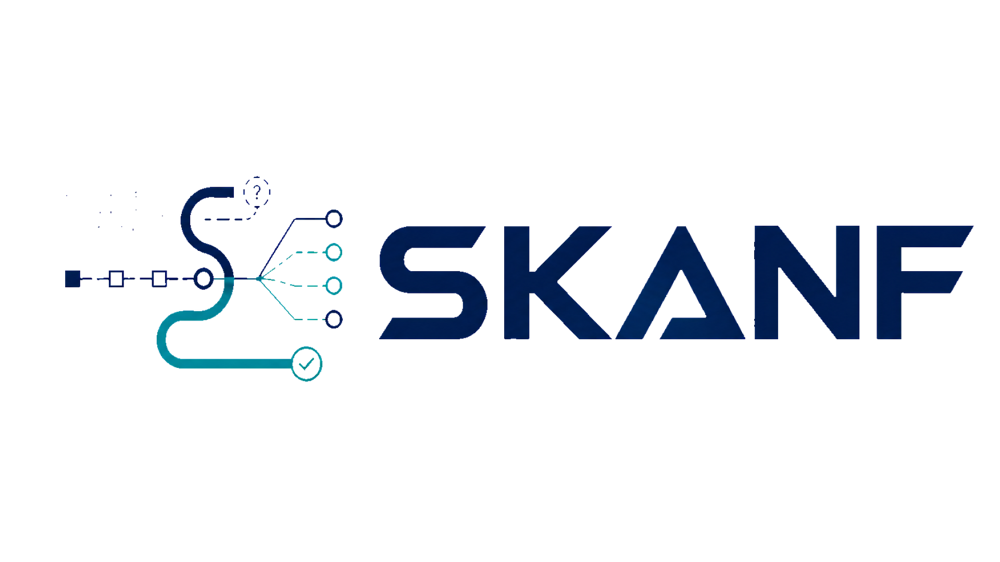

<div align="center">
    
</div>

# SKANF

[](https://arxiv.org/abs/2504.13398)
[](https://hub.docker.com/r/dockerofsyang/skanf)


A tool for detecting asset management vulnerabilities in closed-source and obfuscated EVM smart contracts.

## Installation

### Docker image

The easiest way to run SKANF is through the prebuilt Docker image:

```shell
docker pull dockerofsyang/skanf:latest
```

Set the RPC endpoint and network:

```shell
export WEB3_PROVIDER=http://localhost:8545
export NETWORK=ETH
export SKANF_IMAGE=dockerofsyang/skanf:latest
```

On Linux, SKANF should be run with Docker host networking so that the container can access an RPC node running on the host machine:

```shell
docker run --rm -it --network host \
  -e WEB3_PROVIDER="$WEB3_PROVIDER" \
  -e NETWORK="$NETWORK" \
  "$SKANF_IMAGE" \
  bash
```

If your RPC node is not running on the local machine, replace `WEB3_PROVIDER` with the corresponding RPC endpoint.

### Build from source

You can also build the Docker image locally from this repository:

```shell
docker build -t skanf:latest .
```

Then set:

```shell
export WEB3_PROVIDER=http://localhost:8545
export NETWORK=ETH
export SKANF_IMAGE=skanf:latest
```

Run the locally built image with:

```shell
docker run --rm -it --network host \
  -e WEB3_PROVIDER="$WEB3_PROVIDER" \
  -e NETWORK="$NETWORK" \
  "$SKANF_IMAGE" \
  bash
```

Run the following commands to configure the RPC node and network:

### Local setup

If you have installed the required dependencies locally, including greed and Gigahorse, configure the RPC node and network as follows:

```shell
export WEB3_PROVIDER=http://localhost:8545
export NETWORK=ETH
```

Here, `WEB3_PROVIDER` should point to an Ethereum RPC endpoint. If the RPC node runs on the same machine, `http://localhost:8545` can be used. Otherwise, replace it with the corresponding RPC URL.

## Vulnerability Detection

We are currently withholding the evaluation dataset, as it may raise potential ethical concerns. We are happy to provide additional details or access upon request under appropriate conditions.
Here we demonstrate how to use our tool.

Run the following command to identify the vulnerability in the contract at address `0x0000000000000000000000000000000000000000`:

```shell
cd check_contracts
python3 main.py --address 0x0000000000000000000000000000000000000000 --block 20000000 --mode eval_baseline
```

## Exploit Generation

After identifying a vulnerable contract, run the following command to generate an exploit (which will be stored in the `Exploit` folder):

```shell
cd 
python3 run.py --contract 0x0000000000000000000000000000000000000000 --block 20000000
```


## Academia

If you are using SKANF for an academic publication, we would really appreciate a citation to the following work:
```bibtex
@inproceedings{yang2026insecurity,
  title={Insecurity Through Obscurity: Veiled Vulnerabilities in Closed-Source Contracts},
  author={Yang, Sen and Qin, Kaihua and Yaish, Aviv and Zhang, Fan},
  booktitle={Proceedings of the 2026 ACM SIGSAC Conference on Computer and Communications Security},
  year={2026}
}
```

SKANF also builds on several excellent research tools for EVM bytecode analysis. Please consider citing the related papers for the greed project and Gigahorse listed below.

### [greed](https://github.com/ucsb-seclab/greed/)

SKANF uses greed for symbolic execution over EVM smart contract binaries.

<details>
<summary>BibTeX entries for papers related to greed</summary>

```bibtex
@inproceedings{gritti2023confusum,
title={Confusum contractum: confused deputy vulnerabilities in ethereum smart contracts},
author={Gritti, Fabio and Ruaro, Nicola and McLaughlin, Robert and Bose, Priyanka and Das, Dipanjan and Grishchenko, Ilya and Kruegel, Christopher and Vigna, Giovanni},
booktitle={32nd USENIX Security Symposium (USENIX Security 23)},
pages={1793--1810},
year={2023}
}

@inproceedings{ruaro2024crush,
title={Not your Type! Detecting Storage Collision Vulnerabilities in Ethereum Smart Contracts},
author={Ruaro, Nicola and Gritti, Fabio and McLaughlin, Robert and Grishchenko, Ilya and Kruegel, Christopher and Vigna, Giovanni},
booktitle={Network and Distributed Systems Security (NDSS) Symposium 2024},
year={2024}
}

@inproceedings{ruaro2025approve,
title={Approve Once, Regret Forever: On the Exploitation of Ethereum's $\{$Approve-TransferFrom$\}$ Ecosystem},
author={Ruaro, Nicola and Gritti, Fabio and Meng, Dongyu and McLaughlin, Robert and Grishchenko, Ilya and Kruegel, Christopher and Vigna, Giovanni},
booktitle={34th USENIX Security Symposium (USENIX Security 25)},
pages={1281--1298},
year={2025}
}
```

</details>


### [Gigahorse](https://github.com/nevillegrech/gigahorse-toolchain/)

SKANF uses the Gigahorse toolchain to lift low-level EVM bytecode into a higher-level three-address representation.

<details>
<summary>BibTeX entries for papers related to Gigahorse</summary>

```bibtex
@inproceedings{grech2019gigahorse,
title={Gigahorse: thorough, declarative decompilation of smart contracts},
author={Grech, Neville and Brent, Lexi and Scholz, Bernhard and Smaragdakis, Yannis},
booktitle={2019 IEEE/ACM 41st International Conference on Software Engineering (ICSE)},
pages={1176--1186},
year={2019},
organization={IEEE}
}

@article{grech2022elipmoc,
title={Elipmoc: Advanced decompilation of ethereum smart contracts},
author={Grech, Neville and Lagouvardos, Sifis and Tsatiris, Ilias and Smaragdakis, Yannis},
journal={Proceedings of the ACM on Programming Languages},
volume={6},
number={OOPSLA1},
pages={1--27},
year={2022},
publisher={ACM New York, NY, USA}
}

@article{lagouvardos2025incredible,
title={The Incredible Shrinking Context... in a decompiler near you},
author={Lagouvardos, Sifis and Bollanos, Yannis and Grech, Neville and Smaragdakis, Yannis},
journal={Proceedings of the ACM on Software Engineering},
volume={2},
number={ISSTA},
pages={1350--1373},
year={2025},
publisher={ACM New York, NY, USA}
}
```
</details>
